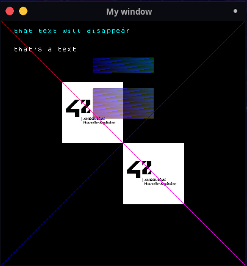

<div align="center">
    
    <div align="center">
        <a href="https://github.com/seekrs/MacroLibX/actions/workflows/linux_clang.yml"></a>
        <a href="https://github.com/seekrs/MacroLibX/actions/workflows/linux_gcc.yml"></a>
        <a href="https://github.com/seekrs/MacroLibX/actions/workflows/macos_x86.yml"></a>
    </div>
    <div align="center">
        <a href="https://github.com/seekrs/MacroLibX/actions/workflows/windows.yml"></a>
    </div>
</div>

###### MacroLibX, a rewrite of 42 School's MiniLibX using SDL2 and Vulkan. 
The goal of this version is to provide a light, fast, and modern graphical tool while keeping the same API.

## 🌟 Features

### 🚀 Performances
Built on top of Vulkan, the MacroLibX takes advantage of its very low-level nature to achieve high performance with great control over available resources.

### 💻 Cross-Platform
Designed to be totally cross-platform, it can run on any SDL2-supported platform that supports Vulkan (even the Nintendo Switch ! theoretically... ).

### 🗿 Close to the old minilibx
One of the guidelines of this lib was to get as close as possible to the old minilibx API, and therefore to the educational choices of the old minilibx.

### 📖 It's all FOSS
Everything in this repo is entirely free and open source, all available under the MIT license (even the third-party libraries used).

### 🔍 Valgrind suppressions file
Experimental for now, a [suppressions file for valgrind](./valgrind.supp) is given to remove potential leaks comming from Xorg, Nvidia drivers, SDL2, or any other tool which the user has no control. It is far from perfect at the moment and may allow some leaks but it will block the majority.

### ⛔ Error system
Strong error handling informing the user of problems with their code and even capable of informing them of graphics memory leaks that tools like Valgrind cannot detect.

## 🖥️ Installation

### Dependencies
You first need to install the proper dependencies for your operating-system. 

#### 🐧 Linux
Here are a few common cases for different Linux distributions:

<details>
  <summary>
    For <a href="https://ubuntu.com">Ubuntu</a>/<a href="https://debian.org">Debian</a>-based distros:
  </summary>
<pre><code><!--
-->sudo apt update
sudo apt install libsdl2-2.0-0 libsdl2-dev build-essential
</code></pre>
</details>

<details>
  <summary>
    For <a href="https://archlinux.org">ArchLinux</a>-based distros:
  </summary>
<pre><code>sudo pacman -S sdl2</code></pre>
</details>

<br>
Note that you need to have up do date video drivers with <code>libvulkan.so</code> installed.

#### 🍎 macOS
[MacroLibX](#) on macOS requires [SDL2](#) and [MoltenVK](https://github.com/KhronosGroup/MoltenVK). You can install both using the [Homebrew](https://brew.sh) package manager:
```sh
brew install molten-vk
brew install SDL2
```

### 🪟 Windows
To build on Windows you may need to use the [xmake](https://xmake.io) build. [Here's](./XMAKE_BUILD.md) how you can use it.

### Clone and Build
Finally, you can clone the Git repository. When inside it, run the GNU `make` command to compile MacroLibX. 
```bash
git clone https://github.com/seekrs/MacroLibX.git
cd MacroLibX
make
```

## 🔨 Compile your project
To compile your project with MacroLibX, you just provide the shared library path in your compilation/linking command:

```sh
clang myApp.c /path/to/MacroLibX/libmlx.so -lSDL2
```

And you can enjoy your project

<p align="center">
    
</p>

## ⚙️ Some compilation configurations

### 📦 Compile mode
By default the mlx is built in release mode but you can switch to debug by using `make DEBUG=true`.

### 🛠️ Set the toolchain
If you want to use `GCC` to build the mlx you can use `make TOOLCHAIN=gcc`

### ⚠️⚠️⚠️ 🖼️ Image optimisations ⚠️⚠️⚠️
If you run into glitches when writing or reading pixels from images you can turn off images optimisations by using `make IMAGES_OPTIMIZED=false`.

### 🖥️ Force the integrated GPU (not recommended)
You can force the mlx to use your integrated GPU by using `make FORCE_INTEGRATED_GPU=true`. Note that there are a lot of chances that your application crashes by using that.

### 💽 Dump the graphics memory
The mlx can dump it's graphics memory use to json files every two seconds by enabling this option `make GRAPHICS_MEMORY_DUMP=true`.

## License
This project and all its files, even the [`third_party`](./third_party) directory or unless otherwise mentionned, are licenced under the [MIT license](./LICENSE).
