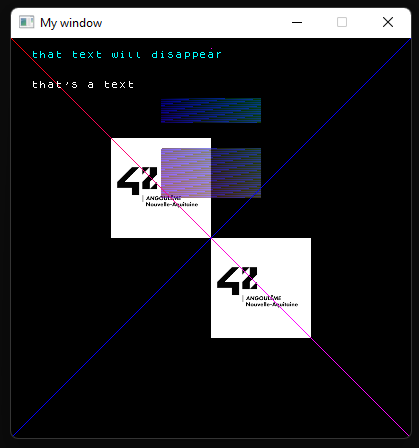

# 🏗️ xmake build
To build on Windows (if you don't use [WSL](https://learn.microsoft.com/en-us/windows/wsl/install)), the MacroLibX uses [xmake](https://xmake.io), a build system which will download and compile all dependencies it won't find on your computer.

## 💾 Install xmake
You can find how to install it on your system [here](https://xmake.io/#/guide/installation). Note that you can also download a [portable version](https://github.com/xmake-io/xmake/releases) of xmake if you wish not to install it.

## ⚙️ Configure the MacroLibX build
Just as the Makfile build system, you can configure how xmake should build the MacroLibX. The base command to configure it is `xmake config [opts...]` or `xmake f [opts...]`.

### 📦 Compile mode
You can configure xmake to build the mlx in debug mode or in release mode (release mode is enabled by default). To do so you can use `xmake config --mode=debug` or `xmake config --mode=release`.

### 🛠️ Set the toolchain
To change the compilation toolchain you can use `xmake config --toolchain=[gcc|clang|...]`

### ⚠️⚠️⚠️ 🖼️ Image optimisations ⚠️⚠️⚠️
If you run into glitches when writing or reading pixels from images you can turn off images optimisations by using `xmake config --images_optimized=n`.

### 🖥️ Force the integrated GPU (not recommended)
You can force the mlx to use your integrated GPU using `xmake config --force_integrated_gpu=y`. Note that there are a lot of chances that your application crashes by using that.

### 💽 Dump the graphics memory
The mlx can dump it's graphics memory use to json files every two seconds by enabling this option `xmake config --graphics_memory_dump=y`.

### 🪛 A possible build configuration
As a configuration example here's how the command can look like `xmake config --mode=debug --toolchain=clang --graphics_memory_dump=y --images_optimized=n`

## 🚧 Build the lib

### Compile using command-line (first method)
Once you're ready to compile the lib, run `xmake` (or `xmake -jX` if you wish not to use all your computer threads, with X being the number of threads you wish to use) and watch as the lib compiles.

### Generate a project (second method)
xmake can also generate a project file for another tool:
* Visual Studio : `xmake project -k vs`
* CMakeLists.txt (which you can open in CLion and more) : `xmake project -k cmake`
* Makefile : `xmake project -k make`
* Ninja : `xmake project -k ninja`
* XCode : `xmake project -k xcode`

You should now be able to open the project file with the tool of your choice.

## 😋 Enjoy
Enjoy you project built with the mlx

    

